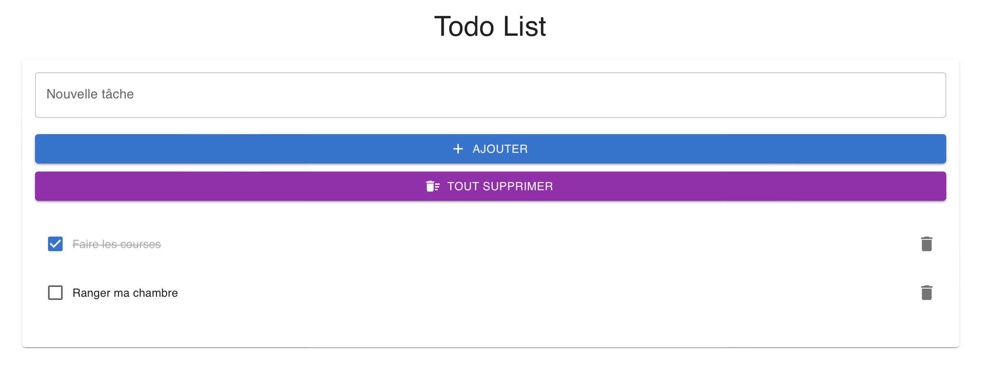

# React-ToDoList

Une application simple pour gérer votre liste de tâches quotidiennes. Créée avec React et stylisée avec Material-UI, cette application vous permet d'ajouter, de marquer comme complétées et de supprimer des tâches de manière intuitive.

## Fonctionnalités

- Ajout de tâches : Saisissez votre tâche dans la zone de texte et cliquez sur le bouton "Ajouter" pour l'ajouter à votre liste.
- Marquage des tâches : Cliquez sur une tâche pour la marquer comme complétée. Elle sera barrée pour indiquer son état.
- Suppression de tâches : Supprimez une tâche individuelle en cliquant sur l'icône poubelle à côté de la tâche.
- Suppression de toutes les tâches : Supprimez toutes vos tâches en une seule action en cliquant sur le bouton "Tout supprimer".

## Comment l'utiliser ?

1. Installation : Clonez le dépôt et naviguez jusqu'au dossier du projet. Exécutez npm install pour installer toutes les dépendances nécessaires.
2. Démarrage : Une fois que tout est installé, exécutez npm start pour démarrer l'application. Elle s'ouvrira automatiquement dans votre navigateur par défaut.
3. Utilisation : Saisissez une tâche, cliquez sur "Ajouter", et gérez votre liste de tâches à votre guise!

## Personnalisation

- Thème : Vous pouvez personnaliser le thème en modifiant les couleurs et les styles dans le thème Material-UI du projet.
- Fonctionnalités : Si vous souhaitez ajouter d'autres fonctionnalités (par exemple, un système d'authentification ou la possibilité de catégoriser les tâches), vous pouvez le faire en modifiant les composants React ou en ajoutant de nouveaux composants.

## Contribution

Si vous avez des suggestions ou des améliorations, n'hésitez pas à ouvrir une issue ou à soumettre une pull request. Toutes les contributions sont les bienvenues!
